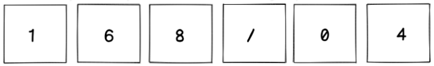

<div align="center">

[English](https://github.com/nandajfa/dont_panic/blob/main/README_en.md) | [Português](https://github.com/nandajfa/dont_panic/blob/main/README.md)

[](https://github.com/nandajfa/dont_panic/blob/main/LICENSE)

</div>

<h2 align="center"> DON'T PANIC, BABY!!!</h2>

### About

> _Don't panic baby is the first setup project of the 3rd edition of 42 Labs._

### ✔️ Technologies

- `HTML`
- `CSS`
- `Javascript`
- `Node`
- `Express`
- `Jest`
- `Swagger`

### 💻 Requirements

- `node v18.12.1`
- `express v4.18.2`
- `jest v29.3.1`
- `cors v2.8.5`
- `nodemon v2.0.20`

### 🛠️ Run the project

```Shell
# Clone this repository
git clone https://github.com/nandajfa/dont_panic.git

# Install the dependencies

# Start the server in the backend folder
cd back
npm start

# Start the server in the frontend folder
cd front
npm start

# To test the project
npm test

# Finish
```

---

### 📑 How to play

<br/>

> _The game consists of guessing the hidden equation that results in “42”. Every guess must be equal to this target number (42) and after each guess, tip characters will show how close you are._

<br />

- The hidden equation is always the same. <br>
- All equations must result in the target number (42), otherwise the equation will be rejected and no answer tip should be provided.<br>
- The accepted inputs are numbers (0-9) and \*, /, +, -.(\*, /, +, -).

The tips are:

- The “T” means the character exists in the hidden equation, but is not in the correct spot.
- The “X” means the character is not in the hidden equation.
- The “C” means the character exists in the hidden equation, and it is in the right position.

Let’s take a look at an example:

<div align="center">




---

### Authors

<table >
  <tr>
    <td align="center"><a href="https://github.com/antoniominoru"><br /><sub><b>Antonio Minoru</b></sub></a><br />
    <td align="center"><a href="https://github.com/B-Mugnol"><br /><sub><b>Bruno Mugnol</b></sub></a><br />
    <td align="center"><a href="https://www.linkedin.com/in/jessica-fernanda-106651205"><br /><sub><b>Jessica Fernanda</b></sub></a><br />
  </tr>

<br/>

<div align="right">
  <b><a href="#about">↥ back to top</a></b>
</div>
